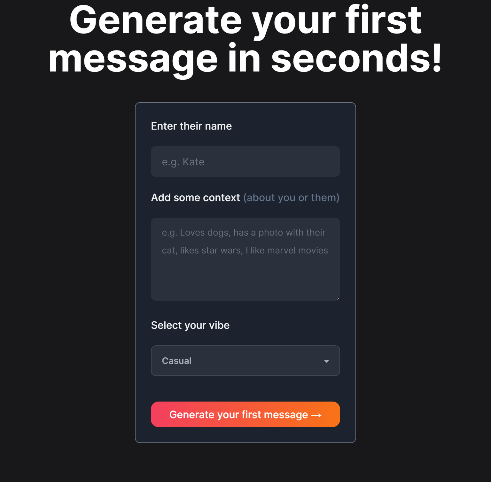

<!-- Improved compatibility of back to top link: See: https://github.com/othneildrew/Best-README-Template/pull/73 -->

<a name="readme-top"></a>

<!--
*** Thanks for checking out the Best-README-Template. If you have a suggestion
*** that would make this better, please fork the repo and create a pull request
*** or simply open an issue with the tag "enhancement".
*** Don't forget to give the project a star!
*** Thanks again! Now go create something AMAZING! :D
-->

<!-- PROJECT SHIELDS -->
<!--
*** I'm using markdown "reference style" links for readability.
*** Reference links are enclosed in brackets [ ] instead of parentheses ( ).
*** See the bottom of this document for the declaration of the reference variables
*** for contributors-url, forks-url, etc. This is an optional, concise syntax you may use.
*** https://www.markdownguide.org/basic-syntax/#reference-style-links
-->

[![Contributors][contributors-shield]][contributors-url]
[![Forks][forks-shield]][forks-url]
[![Stargazers][stars-shield]][stars-url]
[![Issues][issues-shield]][issues-url]
[![MIT License][license-shield]][license-url]
[![LinkedIn][linkedin-shield]][linkedin-url]

<!-- PROJECT LOGO -->
<br />
<div align="center">
  <a href="https://github.com/jolbol1/opening-lines">
    
  </a>

<h3 align="center">Opening Lines</h3>

  <p align="center">
    Generate a opening message to someone new, with context and vibes. Wether professional or for a dating app, let AI help get you started. Say Hello to the Right Person with the Right Words!
    <br />
    <br />
    <br />
    <a href="https://github.com/jolbol1/opening-lines">View Demo</a>
    ·
    <a href="https://github.com/jolbol1/opening-lines/issues">Report Bug</a>
    ·
    <a href="https://github.com/jolbol1/opening-lines/issues">Request Feature</a>
  </p>
</div>

<!-- TABLE OF CONTENTS -->
<details>
  <summary>Table of Contents</summary>
  <ol>
    <li>
      <a href="#about-the-project">About The Project</a>
      <ul>
        <li><a href="#built-with">Built With</a></li>
      </ul>
    </li>
    <li>
      <a href="#getting-started">Getting Started</a>
      <ul>
        <li><a href="#prerequisites">Prerequisites</a></li>
        <li><a href="#installation">Installation</a></li>
      </ul>
    </li>
    <li><a href="#usage">Usage</a></li>
    <li><a href="#roadmap">Roadmap</a></li>
    <li><a href="#contributing">Contributing</a></li>
    <li><a href="#license">License</a></li>
    <li><a href="#contact">Contact</a></li>
    <li><a href="#acknowledgments">Acknowledgments</a></li>
  </ol>
</details>

<!-- ABOUT THE PROJECT -->

## About The Project

[![Product Name Screen Shot][product-screenshot]]()

This app is designed to help users quickly and easily craft the perfect first message to someone new. By providing the person's name and additional context, the app will generate a message tailored to the individual. Whether you're trying to start a conversation with a potential customer, a potential date, or a new colleague, this app will help you make the best impression and get the conversation started. Powered by AI, the app will analyze your input and generate a message that is both appropriate and unique.

<p align="right">(<a href="#readme-top">back to top</a>)</p>

### Built With

- [![Next][Next.js]][Next-url]
- [![React][React.js]][React-url]
- [![Vercel][Vercel-shield]][Vercel-url]
- [![Tailwind][Tailwind-shield]][Tailwind-url]
- OpenAI

<p align="right">(<a href="#readme-top">back to top</a>)</p>

<!-- GETTING STARTED -->

## Getting Started

This is an example of how you may give instructions on setting up your project locally.
To get a local copy up and running follow these simple example steps.

### Prerequisites

This is an example of how to list things you need to use the software and how to install them.

- npm
  ```sh
  npm install npm@latest -g
  ```

### Installation

1. Get a free API Key at [https://openai.com](https://openai.com)
2. Clone the repo
   ```sh
   git clone https://github.com/jolbol1/opening-lines.git
   ```
3. Install NPM packages
   ```sh
   npm install
   ```
4. Enter your API in `.env` (look at .env.example for reference)

<p align="right">(<a href="#readme-top">back to top</a>)</p>

<!-- USAGE EXAMPLES -->

## Usage

1. Select the vibe you want to use for your message.

2. Enter the name of the person you're messaging and any additional context or information you want to include in the message.

3. Click “Generate Message” and the app will generate two messages tailored to the individual, based on the selected vibe.

4. Once you’re satisfied with the message, click “Copy” to copy the message to your clipboard.

5. Paste the message into the conversation and send it.

6. Enjoy the conversation!

<p align="right">(<a href="#readme-top">back to top</a>)</p>

<!-- CONTRIBUTING -->

## Contributing

Contributions are what make the open source community such an amazing place to learn, inspire, and create. Any contributions you make are **greatly appreciated**.

If you have a suggestion that would make this better, please fork the repo and create a pull request. You can also simply open an issue with the tag "enhancement".
Don't forget to give the project a star! Thanks again!

1. Fork the Project
2. Create your Feature Branch (`git checkout -b feature/AmazingFeature`)
3. Commit your Changes (`git commit -m 'Add some AmazingFeature'`)
4. Push to the Branch (`git push origin feature/AmazingFeature`)
5. Open a Pull Request

<p align="right">(<a href="#readme-top">back to top</a>)</p>

<!-- LICENSE -->

## License

Distributed under the MIT License. See `LICENSE.txt` for more information.

<p align="right">(<a href="#readme-top">back to top</a>)</p>

<!-- CONTACT -->

## Contact

Your Name - [@JollyShopland](https://twitter.com/JollyShopland) - github@jamesshopland.com

Project Link: [https://github.com/jolbol1/opening-lines](https://github.com/jolbol1/opening-lines)

<p align="right">(<a href="#readme-top">back to top</a>)</p>

<!-- ACKNOWLEDGMENTS -->

## Acknowledgments

- [AI Twitter Bio Generator](https://vercel.com/templates/next.js/twitter-bio)

<p align="right">(<a href="#readme-top">back to top</a>)</p>

<!-- MARKDOWN LINKS & IMAGES -->
<!-- https://www.markdownguide.org/basic-syntax/#reference-style-links -->

[contributors-shield]: https://img.shields.io/github/contributors/jolbol1/opening-lines.svg?style=for-the-badge
[contributors-url]: https://github.com/jolbol1/opening-lines/graphs/contributors
[Vercel-shield]: https://img.shields.io/badge/vercel-%23000000.svg?style=for-the-badge&logo=vercel&logoColor=white
[Vercel-url]: https://vercel.com/
[Tailwind-shield]: https://img.shields.io/badge/tailwindcss-%2338B2AC.svg?style=for-the-badge&logo=tailwind-css&logoColor=white
[Tailwind-url]: https://tailwindcss.com/
[forks-shield]: https://img.shields.io/github/forks/jolbol1/opening-lines.svg?style=for-the-badge
[forks-url]: https://github.com/jolbol1/opening-lines/network/members
[stars-shield]: https://img.shields.io/github/stars/jolbol1/opening-lines.svg?style=for-the-badge
[stars-url]: https://github.com/jolbol1/opening-lines/stargazers
[issues-shield]: https://img.shields.io/github/issues/jolbol1/opening-lines.svg?style=for-the-badge
[issues-url]: https://github.com/jolbol1/opening-lines/issues
[license-shield]: https://img.shields.io/github/license/jolbol1/opening-lines.svg?style=for-the-badge
[license-url]: https://github.com/jolbol1/opening-lines/blob/master/LICENSE.txt
[linkedin-shield]: https://img.shields.io/badge/-LinkedIn-black.svg?style=for-the-badge&logo=linkedin&colorB=555
[linkedin-url]: https://linkedin.com/in/james-shopland-b48543153
[product-screenshot]: demo.png
[Next.js]: https://img.shields.io/badge/next.js-000000?style=for-the-badge&logo=nextdotjs&logoColor=white
[Next-url]: https://nextjs.org/
[React.js]: https://img.shields.io/badge/React-20232A?style=for-the-badge&logo=react&logoColor=61DAFB
[React-url]: https://reactjs.org/
[Vue.js]: https://img.shields.io/badge/Vue.js-35495E?style=for-the-badge&logo=vuedotjs&logoColor=4FC08D
[Vue-url]: https://vuejs.org/
[Angular.io]: https://img.shields.io/badge/Angular-DD0031?style=for-the-badge&logo=angular&logoColor=white
[Angular-url]: https://angular.io/
[Svelte.dev]: https://img.shields.io/badge/Svelte-4A4A55?style=for-the-badge&logo=svelte&logoColor=FF3E00
[Svelte-url]: https://svelte.dev/
[Laravel.com]: https://img.shields.io/badge/Laravel-FF2D20?style=for-the-badge&logo=laravel&logoColor=white
[Laravel-url]: https://laravel.com
[Bootstrap.com]: https://img.shields.io/badge/Bootstrap-563D7C?style=for-the-badge&logo=bootstrap&logoColor=white
[Bootstrap-url]: https://getbootstrap.com
[JQuery.com]: https://img.shields.io/badge/jQuery-0769AD?style=for-the-badge&logo=jquery&logoColor=white
[JQuery-url]: https://jquery.com
